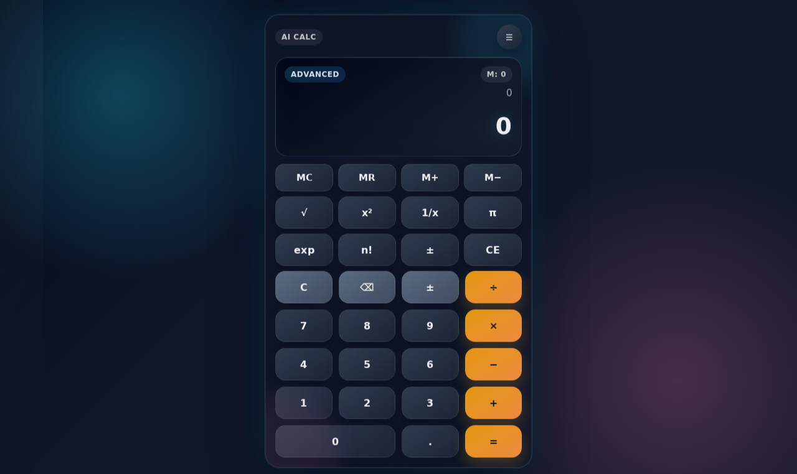

# Modern Calculator
A sleek, premium calculator website built with HTML, CSS, and JavaScript.

## Live Demo
Open the live site here:
https://tejas-mk2.github.io/Calculator/

## Showcase
This calculator features a futuristic dark interface, animated controls, and a refined glassmorphism design.

## Highlights
- Modern glassmorphism interface
- Smooth hover and press animations
- Keyboard-friendly input
- Memory shortcuts and scientific-style operations
- Responsive layout for desktop and mobile

## Run Locally
Serve the project root with a simple static server, or open the index.html file directly in your browser.
