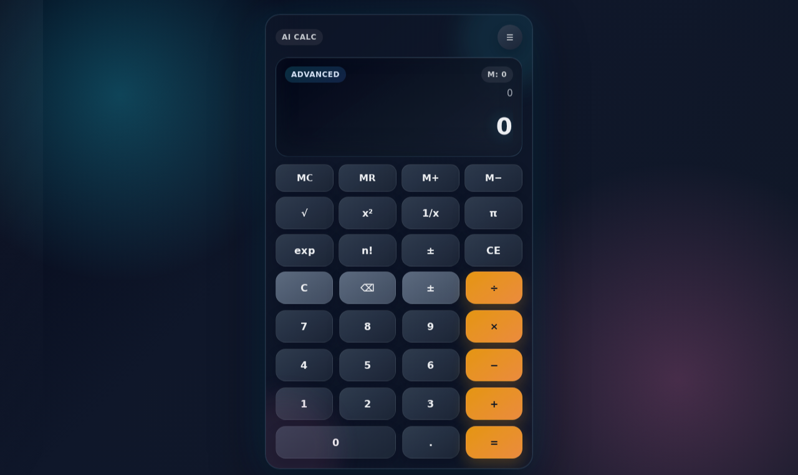

# Modern Calculator 

A polished, feature-rich calculator website built with HTML, CSS, and JavaScript. The experience combines a premium glassmorphism-inspired interface with responsive design, scientific operations, and smooth animations powered by **anime.js**.

## 🌐 Live Demo
Explore the live project here:
https://tejas-mk2.github.io/Calculator/

## 📸 Preview
A refined, futuristic interface with smooth animations, elegant controls, and a clean layout designed for both desktop and mobile use.

##  Features

### Core Functionality
- **Scientific Calculator** - Full scientific operations (sin, cos, tan, log, ln, sqrt, factorial, etc.)
- **Memory Operations** - MC, MR, M+, M- for storing and recalling values
- **Calculation History** - View, search, and reuse past calculations
- **Light/Dark Theme** - Smooth theme toggle with anime.js animations
- **Responsive Design** - Works seamlessly on desktop, tablet, and mobile devices

### Advanced Features
- **Anime.js Animations** - Smooth, performant animations for all interactions
- **Toast Notifications** - Real-time feedback for actions (copy, memory operations, errors)
- **Error Handling** - Comprehensive error checking and validation
- **Keyboard Support** - Full keyboard support (numbers, operators, Enter, Backspace, Escape)
- **LocalStorage Support** - Persistent calculation history and theme preference
- **Accessibility** - ARIA labels, semantic HTML, keyboard navigation

### Scientific Operations
- Basic: `+`, `-`, `*`, `/`, `%`
- Advanced: `√`, `x²`, `1/x`, `π`, `e`, `^`, `!`
- Trigonometry: `sin`, `cos`, `tan` (in degrees)
- Logarithms: `log` (base 10), `ln` (natural)
- Other: `abs`, `exp`, `10ˣ`, `Rand`, `Ans`

## 🛠 Tech Stack
- **HTML5** - Semantic markup with ARIA labels
- **CSS3** - Glassmorphism design, responsive grid layouts
- **JavaScript (ES6+)** - Modern JavaScript with error handling
- **Anime.js** - Animation library for smooth transitions
- **LocalStorage API** - Data persistence

##  New Updates (v2.0)

### Animation Enhancements
-  Anime.js integration for all UI animations
-  Display number scale animations
-  Button press animations with scale effect
-  History panel slide animation
-  Menu dropdown animations
-  Toast notifications with bounce effect
-  Theme toggle rotation animation
-  Glowing box-shadow animation loop

### New Features
-  **Calculation History Panel** - Slide-out panel showing last 50 calculations
-  **History Overlay** - Click to load past results
-  **Clear History** - Remove all calculations from history
-  **History Timestamps** - See when each calculation was performed
-  **Toast Notifications** - Non-intrusive feedback messages
-  **Enhanced Error Messages** - Better error handling with user-friendly messages
-  **Memory Notifications** - Feedback for M+, M-, MC operations
-  **Copy Confirmation** - Toast shows when result is copied

### Improvements
-  Better error handling and validation
-  Improved memory value formatting
-  Random number generation with 4 decimal places
-  Division by zero validation
-  Negative number validation for sqrt and log
-  Factorial validation for non-integers
-  Smoother animations with easing functions
-  Better accessibility with aria-hidden attributes

##  How to Use

### Basic Calculations
1. Click number buttons to enter values
2. Click operator buttons (+, -, *, /)
3. Click = to calculate

### Memory Functions
- **MC** - Clear memory
- **MR** - Recall memory value
- **M+** - Add current value to memory
- **M−** - Subtract current value from memory

### Scientific Operations
- Click any scientific button (√, sin, cos, etc.)
- Operation applies to current display value

### History
- Click 📋 icon to open history panel
- Click any history item to load that result
- Click "Clear History" to remove all calculations

### Keyboard Shortcuts
- **Numbers**: 0-9
- **Operators**: +, -, *, /
- **Decimal**: .
- **Enter**: Calculate (=)
- **Backspace**: Delete last digit
- **Escape**: Clear or close panels

## 📱 Responsive Breakpoints
- **Desktop**: Full calculator with all features visible
- **Tablet (640px)**: Optimized button sizes
- **Mobile (380px)**: Compact layout with adjusted font sizes
- **Small (360px)**: Extra compact with minimal padding
- **Landscape**: Optimized for landscape orientation

##  Error Handling
The calculator includes comprehensive error handling:
- Empty expression validation
- Division by zero prevention
- Invalid factorial detection
- Negative number validation for sqrt/log
- Non-finite result detection
- Type validation for all inputs
- Try-catch blocks around critical functions

##  Data Persistence
- **Theme Preference**: Saved to localStorage
- **Calculation History**: Last 50 calculations stored in localStorage
- **Memory Value**: Session-based (cleared on page reload)

##  Customization
You can customize the calculator by modifying:
- **Colors**: CSS custom properties in `:root`
- **Animations**: Anime.js configuration in script.js
- **Font**: Change the font-family in styles.css
- **Layout**: Modify grid layouts in styles.css

##  Known Limitations
- Memory value is not persistent (clears on page reload)
- Very large numbers may display in scientific notation
- History is limited to 50 most recent calculations
- Trigonometric functions use degrees (not radians)

##  About
Built by **Pijush Chakraborty** as a modern web-based calculator experience that balances aesthetics, usability, and performance.

##  License
Licensed under the Apache License 2.0. See LICENSE file for details.

##  Contributing
Contributions, issues, and feature requests are welcome!

##  Support
For issues or questions, please open an issue on GitHub.

---

**Enjoy calculating with style!** 
