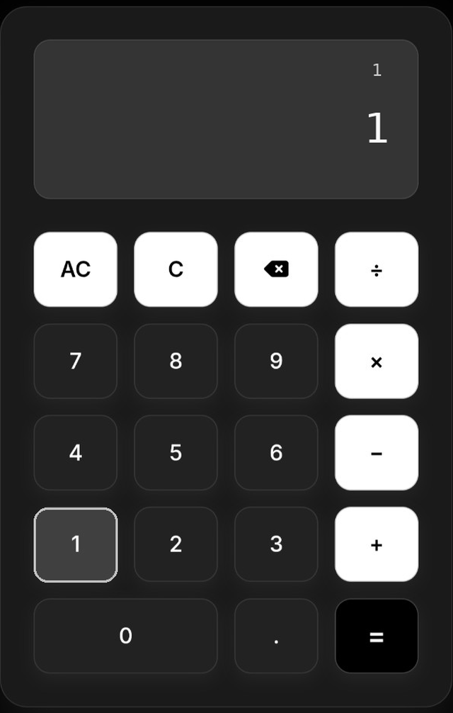

# Modern Calculator

<p align="center">
  <strong>A clean, responsive, modern calculator for the web.</strong><br>
  Built with HTML, CSS, JavaScript, and Anime.js.
</p>

<p align="center">
  <a href="https://tejas-mk2.github.io/Calculator/">Live Demo</a> ·
  <a href="https://github.com/TEJAS-MK2/Calculator/issues">Report a Bug</a> ·
  <a href="https://github.com/TEJAS-MK2/Calculator/pulls">Contribute</a>
</p>

---

## Demo

<p align="center">
  
</p>

## Features

- **Fast responsive calculator** — works across desktop, tablet, and mobile.
- **Modern UI** — clean layout with a polished visual system.
- **Arithmetic engine** — addition, subtraction, multiplication, and division.
- **History** — stores recent calculations locally and lets you reuse results.
- **Memory** — supports calculator memory operations.
- **Theme system** — dark, light, and system themes.
- **Keyboard support** — numbers, operators, Enter, Backspace, Escape, and C.
- **Error handling** — protects against invalid input and division by zero.
- **Anime.js motion** — lightweight interface animations and interaction feedback.
- **Responsive layout** — optimized for smaller screens as well as desktop displays.
- **PWA support** — service-worker caching for a more app-like experience.

> The sidebar is intentionally minimal: **History**, **Clear**, and **Change Theme**. Feature actions open or control the calculator in the main interface rather than duplicating the calculator UI inside the sidebar.

## Calculator Controls

| Category | Operations |
|---|---|
| Arithmetic | `+` `−` `×` `÷` |
| Input | `0–9` `.` |
| Controls | `AC` `C` `Backspace` `=` |
| Memory | `MC` `MR` `M+` `M−` `MS` |
| History | Open, reuse, and clear calculations |
| Theme | Dark, Light, System |

## Keyboard Shortcuts

| Key | Action |
|---|---|
| `0–9` | Enter number |
| `+` `-` `*` `/` | Choose operator |
| `.` | Decimal point |
| `Enter` / `=` | Calculate |
| `Backspace` | Delete last digit |
| `Escape` | Clear all |
| `C` | Clear current input |

## Architecture

The calculator is intentionally organized around a single core calculator controller:

```text
Calculator
├── Calculator engine
├── History
├── Memory
├── Theme system
├── Minimal sidebar
├── Anime.js animations
└── Service-worker cache
```

The sidebar is navigation only. It does not own calculator feature panels, which helps prevent duplicate event handlers, DOM conflicts, animation races, and inconsistent UI state.

## Tech Stack

- **HTML5** — structure and accessibility
- **CSS3** — responsive layout, themes, and visual effects
- **JavaScript (ES6+)** — calculator engine and application state
- **Anime.js** — UI animations and micro-interactions
- **Bootstrap 5** — responsive utilities
- **Font Awesome** — interface icons
- **Service Worker** — application-shell caching

## Animations

Anime.js is used for controlled UI motion including:

- Calculator entrance animation
- Button press feedback
- Display transitions
- Result transitions
- History animations
- Theme transitions
- Sidebar open/close motion

Animations respect `prefers-reduced-motion` where supported.

## Themes

The calculator supports three theme modes:

- **Dark**
- **Light**
- **System** — follows the operating system preference

Theme state is stored locally in the browser and applied through shared CSS variables so calculator panels remain visually consistent.

## Error Handling

The calculator handles common edge cases including:

- Division by zero
- Invalid numeric values
- Invalid scientific operations
- Floating-point rounding artifacts
- Very large or very small results
- Corrupted local history or memory data

## Performance

The application is designed to avoid unnecessary work during interaction:

- Lightweight DOM updates
- Local persistence through `localStorage`
- Animation cleanup before starting a replacement animation
- Reduced-motion support
- Service-worker asset caching
- No backend required for normal calculator operation

## GitHub Pages

The calculator is deployed as a static website through GitHub Pages and runs primarily in the browser.

**Live:** https://tejas-mk2.github.io/Calculator/

## Development

Clone the repository:

```bash
git clone https://github.com/TEJAS-MK2/Calculator.git
cd Calculator
```

Open `index.html` directly for a simple local preview, or use any static HTTP server for a more production-like environment.

## Project Package

An npm-compatible calculator package is also maintained under:

```text
packages/calculator-core/
```

The package is currently kept in the repository and is **not being published to npm** at this time.

## Contributing

Contributions, bug reports, and feature requests are welcome. Please open an issue or submit a pull request.

Before submitting changes, test the calculator interactions and check the UI on both desktop and mobile-sized screens.

## License

Licensed under the Apache License 2.0. See [`LICENSE`](./LICENSE) for details.

## About

Built by **Pijush Chakraborty** as a modern web calculator focused on simplicity, responsiveness, usability, performance, and polished interaction.

---

<p align="center"><strong>Calculate with style.</strong></p>
